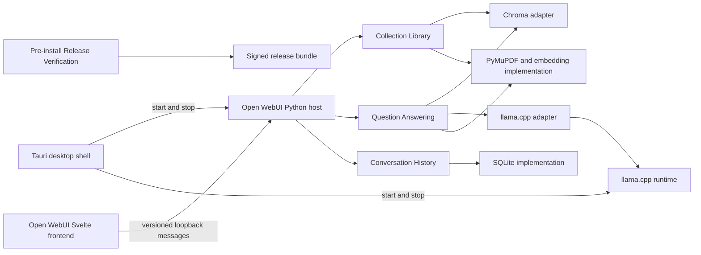

# Secure Local Document QA: Codebase Design

Status: approved design direction; written design awaiting review. This repository contains a documentation-only scaffold, with no workflow implementation.  
Design basis: the user-provided *Secure Local Document-QA System* SDD, sections 1–18, [ADR 0001](../../architecture/decisions/0001-open-webui-offline.md), and [ADR 0002](../../architecture/decisions/0002-feature-first-layout.md).

## 1. Purpose and governing constraints

The application runs for one authorized local user on an air-gapped laptop. The release must work on first launch without downloads, cloud accounts, external network access, or live connections to sensitive systems. It manages a permanent approved PDF library and answers questions with evidence classifications and expandable page citations. Windows x86-64, macOS Apple silicon, and Ubuntu Linux x86-64 receive distinct signed packages. The 8 GB laptop is the performance qualification target.

The SDD's four primary Python workflow modules remain the owning modules. Open WebUI supplies selected frontend and retrieval implementation, but its objects, routes, and database schema do not become the four workflow interfaces. A custom Tauri shell starts a pinned Open WebUI Python backend and the selected llama.cpp runtime. Both listeners bind to `127.0.0.1`; the laptop has no external network connection. This revises the SDD's React and no-HTTP-listener choices while preserving its air-gap and no-externally-reachable-listener requirements.

## 2. Approaches considered

| Approach | Reuse | Cost and fit | Decision |
| --- | --- | --- | --- |
| Pinned Open WebUI fork, custom Tauri shell, dedicated workflow modules | Open WebUI Svelte frontend, chat presentation, local history implementation, and selected retrieval code | Requires a narrow maintained fork and loopback-only backend; supports the SDD workflows behind our own interfaces | **Selected** |
| Official Open WebUI Desktop fork | Most desktop behavior | Current desktop uses Electron, requires internet on first launch, and supports online update/remote connections that would need removal | Rejected for this release |
| Original Tauri/React application with independent Python workflows | Preserves original transport choice | Little direct frontend reuse and substantial new chat and retrieval code | Fallback only if the selected approach fails packaged offline or memory qualification |

Open WebUI's native knowledge lifecycle is mutable and its general chat path permits capabilities outside this product's scope. The fork is an implementation source, not the owner of collection publication or evidence rules. All upstream changes are pinned, reviewed, and tested before inclusion. See [Open WebUI development](https://docs.openwebui.com/getting-started/advanced-topics/development/), [RAG](https://docs.openwebui.com/features/chat-conversations/rag/), and [Desktop](https://github.com/open-webui/desktop/blob/main/README.md).

## 3. Module map and dependency direction



The four primary modules own behavior. Thin host routes translate versioned requests and events to those interfaces. The frontend renders returned state and never decides whether a claim is supported, whether publication is safe, or whether a citation is valid. Tauri owns process lifecycle and resolves approved application paths; the Python backend receives selected PDF content and owns staging. Open WebUI frontend and retrieval code are internal to the host and workflow implementations; no Open WebUI data type appears in a primary module interface or durable domain record. The fork routes all product chat, PDF import, and history mutations through these modules. Generic Open WebUI routes that could bypass publication review, answer validation, or disabled persistence are unavailable in the release build.

## 4. Primary module interfaces

An interface includes types, invariants, ordering, failures, and relevant performance behavior. All four modules are tested through these interfaces. Request and result names below describe domain values; their wire representation is versioned separately.

### 4.1 Collection Library

| Operation | Input and result | Required behavior |
| --- | --- | --- |
| `review_candidate(files)` | Approved local file handles → `CandidateReview` with accepted files, rejected files, reasons, warnings, page counts, and review ID | Copies to staging; validates PDF type, limits, readability, and extractable text before publication. No active-version change. |
| `publish(review_id, accept_valid_remainder)` | Reviewed candidate → publication job ID and progress events, then version or failure | Refuses unacknowledged rejected files; builds, checks, smoke-tests, and atomically activates the complete candidate. |
| `list_versions()` | → active and previous version summaries | Never presents incomplete staging as a published version. |
| `active_version()` | → version or `None` | Returns the version used for new questions. |
| `rollback()` | → newly active previous version or explicit unavailable result | Atomically changes the active pointer only after integrity validation. |
| `cancel(job_id)` | → cancellation result | Discards incomplete staging and leaves the active version unchanged. |

`review_candidate` and `cancel` make the SDD's review and cancellation workflows callable through the interface. They refine, rather than replace, its publish/list/active/rollback interface. One publication runs at a time. Activation commits one durable active-version pointer after the manifest, source PDFs, chunks, embeddings, index, counts, checksums, and search smoke test pass. Only the active and immediately previous complete collection snapshots remain. Startup recovers the last committed pointer and removes or quarantines staging data. An insufficient-space failure occurs before index build or activation and reports required and available space.

Each version uses stable document IDs from file checksums and stable chunk IDs from document ID, page, chunk order, and frozen chunking configuration. Chroma is the selected production document-store adapter for the single-worker MVP; the deterministic fake adapter powers workflow tests. This choice uses Open WebUI's locally maintained default and avoids a separate Qdrant process. Version-specific Chroma collections and a durable pointer provide snapshot switching; Open WebUI's ordinary knowledge-base mutation path is not used to activate a version. Rollback swaps the active and previous pointers after validation. An answer holds a read lease on its pinned version so cleanup cannot delete that version mid-request; a request naming an unavailable version fails explicitly. The 10,000-page and 8 GB gates must qualify this decision before release. [Open WebUI vector configuration](https://docs.openwebui.com/reference/env-configuration/).

### 4.2 Question Answering

`answer(AnswerRequest) -> AnswerResult` accepts the question, the active collection version, and whether general model knowledge is enabled. The setting defaults to enabled in the interface. The result contains document-supported sections, general-knowledge sections, limitations, citations, warnings, evidence mode, model version, collection version, and timings. A request may be cancelled by request ID. One answer job runs at a time; the frontend disables or queues a second request.

The implementation embeds the question with the same frozen embedding model used for the selected collection, retrieves ranked chunks, applies the release-frozen relevance threshold, and deterministically selects visual evidence when indicated. It renders at most two retrieved PDF pages for multimodal inference. Source text is delimited as untrusted data. The model receives no tools or file-modification capability. The typed answer is validated against the evidence IDs actually supplied to the model. One corrective generation is allowed; if validation still fails, unsupported document sections are withheld and the result explains why. General knowledge remains visibly separate and has no document citation. If nothing meets the relevance threshold, the result says the collection lacks sufficient evidence and may include only labeled general knowledge. Retrieval failure produces no document-supported section. Conflicting evidence and a page unavailable through text retrieval are reported as limitations.

Citation IDs resolve to document ID, page, supporting chunk IDs, evidence classification, and reliable coordinates when available. The frontend expands them into locally rendered pages and highlights reliable text coordinates. Rendering and caching stay inside the owning implementations, not in frontend state. Open WebUI's retrieval and citation-display code may be reused internally, but the structured result and validation rule are owned here. Disable Open WebUI's autonomous Builtin Tools while retaining controlled file-context retrieval. [Open WebUI RAG and tool modes](https://docs.openwebui.com/features/chat-conversations/rag/).

The model-runtime seam has a llama.cpp production adapter and a deterministic test adapter. The production adapter reaches a packaged model through loopback only, exposes exactly the selected model, and reports load failure separately from retrieval failure. Model load failure leaves the Library available.

### 4.3 Conversation History

`save`, `list`, `load`, `delete`, `clear`, and `set_persistence(enabled)` remain the interface. The implementation may reuse Open WebUI's local SQLite chat storage, but this module owns migrations and stored domain records. Each saved answer records model and collection versions, evidence mode, citations, warnings, and timings. Disabling persistence stops new writes, including updates to an already saved conversation; the current unsaved answer remains visible. Re-enabling persistence affects future saves. A save failure returns a warning without discarding the current answer.

The SDD keeps only two complete collection snapshots while historical conversations retain older version IDs. To keep historical page citations expandable, this module maintains a deduplicated citation archive of **pages actually cited by saved answers**, keyed by source checksum and page. Removing an old collection does not remove those cited pages. Deleting a conversation or clearing history removes unreferenced archived pages. This archive is not a third searchable collection and does not duplicate every page of the corpus. Open WebUI's temporary-chat behavior can help implement disabled persistence, but the interface test verifies the no-write invariant. [Open WebUI temporary chats](https://docs.openwebui.com/features/chat-conversations/chat-features/url-params/).

### 4.4 Release Verification

`verify(bundle_path, expected_platform) -> VerifiedRelease | Rejection` validates the manifest signature using a previously trusted public key, checks every listed checksum, verifies the platform identifier and completeness, and records a sanitized verification event. There is no bypass. The same interface is tested with authentic, modified, unsigned, corrupt, incomplete, and wrong-platform bundles.

Verification runs **before installation** in a small verifier available on the air-gapped laptop. Its authenticity must be established independently of the untrusted removable-media bundle, through pre-provisioning or trusted operating-system signing. A verifier shipped only inside the bundle would not establish a root of trust. The installed application may also recheck its own release metadata at startup, but that does not replace pre-install verification.

## 5. Supporting seams and transport

The platform-operations seam has platform-specific Tauri/OS adapters and test adapters for paths, atomic filesystem operations, free-space checks, process lifecycle, and installer integration. PDF processing stays inside Collection Library and Question Answering until a second genuine implementation justifies a seam. The document-store and model-runtime seams exist because production and deterministic test adapters must satisfy the same interface. Internal seams do not expand the four primary interfaces. A supporting Operational Diagnostics module accepts sanitized events and exports a local diagnostic report; it owns log rotation and excludes complete questions, answers, and document text.

The frontend-host transport uses versioned loopback messages with request ID, operation, validated payload, progress events, and one terminal result or error. Cancellation names the request ID. Unknown operations and fields fail closed. Tauri starts the Python host and llama.cpp only on `127.0.0.1`, shows a bundled startup screen until the Python host is ready, then navigates its webview to the backend-served Svelte frontend. The frontend uses same-origin requests to the Python host and receives no Tauri shell or filesystem capability by default. Tauri stops both child processes on exit. A browser outside the desktop shell must not be part of the intended workflow. Loopback is reachable by other local processes under the same operating-system trust model; it is not a substitute for OS account security. No listener binds a non-loopback address. Tauri documents both bundled sidecars and HTTP webview URLs. [Sidecars](https://v2.tauri.app/develop/sidecar/), [configuration](https://v2.tauri.app/reference/config/).

## 6. Offline and capability controls

The release includes the exact Open WebUI source revision and built frontend assets, Python wheels, PyMuPDF, Sentence Transformers model cache, Chroma data support, llama.cpp binary, selected multimodal GGUF model, verification key, and platform-specific Tauri assets. The application does not install or update packages at runtime. `OFFLINE_MODE=true`, `HF_HUB_OFFLINE=1`, and model auto-update flags are set; network isolation and release tests enforce the stronger no-outbound requirement because Open WebUI's offline flags do not block configured external connections. [Open WebUI offline guidance](https://docs.openwebui.com/tutorials/maintenance/offline-mode/).

Disable plugin execution, built-in model tools, code execution, web search, remote connections, autonomous retrieval, URL imports, unreviewed file uploads, and model download controls in the product configuration and host routes. The single selected model and approved collection are the only available sources for answering. The fresh single-user installation has no application login, consistent with the SDD's operating-system trust assumption; all host listeners remain loopback-only. Diagnostic logs exclude complete questions, answers, and document text. The fork retains required Open WebUI license notices and branding according to the pinned revision's license. [Hardening guidance](https://docs.openwebui.com/getting-started/advanced-topics/hardening/), [Open WebUI license](https://github.com/open-webui/open-webui/blob/main/LICENSE).

## 7. Feature-first repository layout

This is one desktop product, so `app/` groups its source, tests, benchmarks, and release assembly. It is a repository directory, not a Python package. Inside `app/`, the Tauri shell and Open WebUI fork remain separate projects. The fork keeps its upstream **frontend** in `src/` and **backend** in `backend/`; new work is grouped by feature within each runtime. SvelteKit expects routes under `src/routes` and reusable client code under `src/lib`; FastAPI supports registering feature-specific routers from separate Python files. The layout also matches Tauri's `src-tauri/` convention. [Open WebUI development](https://docs.openwebui.com/getting-started/advanced-topics/development/), [SvelteKit project structure](https://svelte.dev/docs/kit/project-structure), [FastAPI larger applications](https://fastapi.tiangolo.com/tutorial/bigger-applications/), [Tauri project structure](https://v2.tauri.app/start/project-structure/).

```text
app/                              One desktop product; grouping directory only
  desktop/                        Tauri Rust shell, startup screen, sidecar lifecycle
    src-tauri/                    Future Tauri source, capabilities, configuration, binaries
    tests/                        Shell startup, readiness, and shutdown tests
    benchmarks/                   Packaged startup and whole-process memory checks
  open-webui/                     Future pinned Open WebUI source fork
    src/                          SvelteKit frontend; upstream layout stays in place
      lib/features/
        library/                  PDF review and publication UI, with local UI tests
        answering/                Chat answer and citation UI, with local UI tests
        history/                  Conversation UI, with local UI tests
        settings/                 User settings UI, with local UI tests
      routes/                     Thin SvelteKit route entry points
    backend/                      Python host; upstream layout stays in place
      open_webui/                 Upstream host and narrow integration edits
      secure_qa/
        library/                  Collection Library; wire/, tests/, benchmarks/
        answering/                Question Answering; wire/, tests/, benchmarks/
        history/                  Conversation History; wire/, tests/
        release_verification/     Release Verification; wire/, tests/
        diagnostics/              Sanitized events, rotation, export; tests/
        tests/integration/        Host-to-workflow contract tests
  release/                        Bundle assembly and pre-install verifier packaging
    tests/                        Verifier packaging tests
    acceptance/                   Full packaged offline tests on each platform
docs/architecture/decisions/      Decisions that amend the SDD; outside product assets
```

Feature folders contain their own internal adapters when they exist: for example, Chroma under `library/`, llama.cpp under `answering/`, and SQLite under `history/`. Each backend feature owns its versioned transport schema in `wire/`; the frontend feature consumes types derived from that schema. The domain interface remains independent of HTTP and Open WebUI objects. Frontend tests sit beside the feature views they exercise. Backend interface and adapter tests sit inside the owning feature's `tests/`; host-to-workflow tests sit in `secure_qa/tests/integration/`. Library and Answering benchmarks sit beside the workflows they measure. Shell-level performance checks belong to `app/desktop/benchmarks/`; full package acceptance belongs to `app/release/acceptance/` because it crosses every runtime. SvelteKit and pytest both document colocated unit tests as supported layouts. [SvelteKit project structure](https://svelte.dev/docs/kit/project-structure), [pytest test layouts](https://docs.pytest.org/en/stable/explanation/goodpractices.html#choosing-a-test-layout).

| Feature | Frontend and local UI tests | Backend module, schema, and tests | Benchmark owner | Desktop role |
| --- | --- | --- | --- | --- |
| Library | `app/open-webui/src/lib/features/library/` | `app/open-webui/backend/secure_qa/library/{wire,tests}/` | `library/benchmarks/` | Supply approved app-data path; manage host lifecycle |
| Answering | `app/open-webui/src/lib/features/answering/` | `app/open-webui/backend/secure_qa/answering/{wire,tests}/` | `answering/benchmarks/` | Start and stop llama.cpp binary |
| History | `app/open-webui/src/lib/features/history/` | `app/open-webui/backend/secure_qa/history/{wire,tests}/` | Included in package acceptance | Supply approved app-data path |
| Release Verification | No chat view | `app/open-webui/backend/secure_qa/release_verification/{wire,tests}/` | Included in package acceptance | Display verified release metadata after installation |
| Settings | `app/open-webui/src/lib/features/settings/` | Calls the settings owned by Answering and History | Included in feature and package tests | No direct desktop command |

Open WebUI's existing files stay at their upstream paths. Product-specific frontend behavior goes under `src/lib/features/<feature>/`; `src/routes` and reused upstream chat views receive only the integration edits needed to call it. Product-specific Python behavior goes under the sibling `backend/secure_qa/<feature>/` package; the `backend/open_webui/` host receives only route registration and capability restrictions. Cross-feature calls use another module's public interface, never its storage or adapter internals. The pinned upstream revision, local changes, build dependencies, models, and release checksums are recorded in the release manifest.

The current scaffold contains only README files describing these destinations. It does not vendor Open WebUI, create Python, Svelte, or Tauri source files, select model weights, or assemble a release.

## 8. Verification and release gates

Workflow tests cross the four interfaces and assert observable outcomes. Collection tests cover rejected-file acknowledgment, failed and cancelled publication, atomic activation, rollback, retention, and startup recovery. Answer tests cover insufficient evidence, evidence labels, citation correction and withholding, visual selection and the two-page limit, model-load failure, and cancellation. History tests cover persistence settings, save failure, deletion, and historical citation expansion. Release tests cover all rejection modes. Integration tests exercise packaged Open WebUI-to-workflow messages and focused production adapters without reaching into private workflow state. Frontend tests cover Library review and progress, answer and citation display, history failures, keyboard navigation, visible focus, semantic labels, contrast, and progress and error announcements.

Packaged acceptance tests run with networking disabled on all three platform targets. They cover first launch, import, retrieval, answering, citation expansion, history, startup recovery, bundle verification, no non-loopback listeners, no DNS or outbound attempts, and no runtime download. They also prove that ordinary Open WebUI routes cannot bypass the four owning modules. The selected model and Chroma layout must meet the SDD's 8 GB reference-laptop memory limit, below-30-second text target, two-minute visual target, and 10,000-page stress target. Model selection uses the SDD's benchmark eligibility and ranking criteria. If the Open WebUI fork cannot pass offline packaging or memory qualification, the fallback architecture requires a new decision record before implementation changes direction.

## 9. SDD traceability and explicit amendments

| SDD requirement | Owning module or decision |
| --- | --- |
| 4.1 and 6: validated, atomic collection publication | Collection Library |
| 4.2 and 7: evidence classification, visual limit, citation validation | Question Answering |
| 4.3 and 8: conversation persistence and deletion | Conversation History |
| 4.4 and 14: signed bundle verification | Release Verification, executed before installation |
| 4.5: replaceable document store, model, and platform behavior | Chroma, llama.cpp, and platform-operations seams |
| 4.6: typed local messages and cancellation | Versioned loopback transport |
| 9, 10, and 15: recovery, offline operation, sanitized logs | Each owning module plus packaged acceptance tests |
| 12 and 13: resource and benchmark gates | Reference-laptop qualification and interface tests |

The linked decision record amends the SDD's React/Vite frontend and no-HTTP-server statements to Svelte/Open WebUI with loopback-only transport. This design also makes the review and cancel operations explicit in Collection Library, preserves historical citations after collection retirement, and locates Release Verification before installation. All other listed MVP scope and exclusions remain in force.
